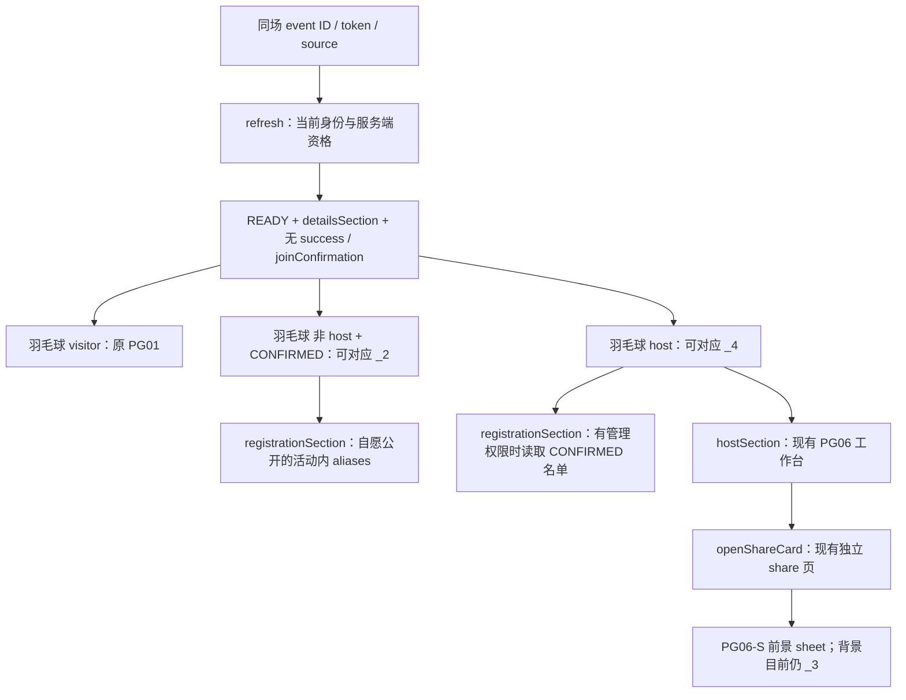

# 下一批详情、名单与分享背景来源差距（Wave 69 只读准备）

日期：2026-10-02。范围：原稿 `_2`、`_4`、`_5`、`pg06_s`；对照 Wave 68 不可变工程。本文是只读来源准备，**没有实施这些详情屏，没有运行业务测试、CLI、SDK、微信实点或全量检查**。Wave 69 PG06／PG08／PG09 与分享前景的独立审查另行记录，不能以本文代替。

原稿中的静态名单、付款、凭证、地图和自动运营文案是设计素材；不是本批新增产品指令或真实服务能力。

## 1. 来源与不可变基线

已完整读取四份 HTML、实际查看四份 PNG，并逐字节核对用户 ZIP 的对应 8 个条目。ZIP：`/Users/tsb/Downloads/stitch_design_system_generator (2).zip`，24,668,856 B，SHA-256 `df22e733d33fda20979b75b8a7bc94717c4a5c9e41561a54e3038432fab32603`。

原稿根目录：`/private/tmp/irl-stitch-original/stitch_design_system_generator/`。完整节点、原 `class/style`、祖先上下文、字体 URL、远程图片 URL 和现有绑定清单保存在独占临时资料：

`/private/tmp/caper-wave70-detail-review/source-and-binding-inventory.json`，SHA-256 `3fd5b5dcc115586621ff04fa6b0ac05f2f971950a9809d8e865479d7f5865608`。

| 原稿 | HTML SHA-256 | PNG SHA-256 / 尺寸 | 与 ZIP |
| --- | --- | --- | --- |
| `_2` | `80302149355f18cbde31733cea7da909f6ba1a31cd66e4d651a81a75986ede1c` | `96bec6456208ce0559b3a25f4ac4282353fc214dedd2a3a4ef258f39f69b5819` / 328 × 1,600 | 两文件同字节 |
| `_4` | `5891318df87bc1c022164130244b1a5739fc706e46bbb837e90553abb690fd62` | `0678bf3300b8dbae51812345d01d18b91cab36ca029903582f5039fbc3c26296` / 398 × 1,600 | 两文件同字节 |
| `_5` | `e2a2ce2fb2266283f7762dca23592c732eca385d88ce1772f1e22a41bec8b024` | `c304525527f9fcab9c7e6646ed13e8b63a3febeff3c34880f8f1ff91f7b7b3cb` / 400 × 1,600 | 两文件同字节 |
| `pg06_s` | `ae332500609017a0a0d467d88b52ff0942e3b2824dc542e8f5bd65e5e18527c5` | `25784a100075b14dccb1f3e0b0a562df4ffc9f5ef90f5dacfa900138a4b848f0` / 672 × 1,600 | 两文件同字节 |

基线：`/private/tmp/caper-ui68-immutable-keerh5mh`（父代理已经核验其与提交 `2e3e027` 的实际 clone 496 文件相同）。本次独立读取事件详情、报名、实际函数和 CSS；下列为本次实际读取文件 hash，不以历史 Wave 67 路径或旧入口 stub 代替。

| Wave 68 文件（`miniprogram/subpackages/activity/` 下） | B | SHA-256 |
| --- | ---: | --- |
| `event/event.wxml` | 107,929 | `06741c8056566a32f33f356ce65f9aabfcb2164d950a6c288c28e2ec48f0fdf3` |
| `event/event.wxss` | 131,951 | `36f4980f427bdf6502ffa2f068dbd935bd028a37c5b563f6860c76715a3b742f` |
| `event/event.js` | 104,047 | `ccb5b5fede066ba0533b82cb564e816cc3d45ca96778a0d25ac5286d3c11a4bd` |
| `event/event.json` | 69 | `bf33dc7da099d240642a50fe3cf44cee01a2b282f70a80a313c79317c76ad10b` |
| `share/share.wxml` | 10,695 | `fa6664d9fc3a697509fee78362a4dbec909b6051cc7a6656655622a6f1560af5` |
| `share/share.wxss` | 13,329 | `8309549f016b13b98e2496551089e88a069265c6d0b60b2ac8bb5a3b562f196c` |
| `share/share.js` | 27,274 | `5fdde14c88902bb18e4c045d81326974978d718c6181d94cf76c86f2177a8258` |
| `share/share.json` | 75 | `95f4181c4eb25045c994138c56d0741f84443d00426599975f8a3fe4f24e4262` |

## 2. 真实页面映射与 guard

- `event.js:256` 的 `sectionAvailable` 只提供详情、报名、公告、签到、费用、host 工作台及按能力授权的协办区域；没有 `_5` 的独立 section、mode 或 query 契约。
- `onLoad:299` 默认 `detailsSection`；有资格的真实 `section` 参数由加载后校验。主办已发布和成员报名成功是另两个真实 `successState`，应继续保护 PG04-S／PG05-S，而不是混入 `_2`／`_4`。
- 最小 `_2` scope 应由 **READY、detailsSection、羽毛球、非 host、myRegistration.CONFIRMED、无 success、无 joinConfirmation** 限定。`_4` 同样限定 READY／详情／羽毛球／host／无成功或确认弹层。
- `RECONFIRM_REQUIRED`、WAITLISTED、OFFERED、REQUESTED、非羽毛球、加载失败、访客和协办区域不能被上述确认席位视觉覆盖。原稿已确认 badge 必须取真实报名状态，标题和活动状态也由服务端派生。
- `scrollToSection:776` 已在切换时清理签到码及费用分享操作、更新标题，并原生滚到顶部；保留此实际行为。不能为了原稿只读屏删除公告、签到、费用、举报等现有入口。

## 3. 数据与名单边界

| 实际数据／函数 | 当前事实 | 复刻时的约束 |
| --- | --- | --- |
| `event / display / event.stats` | 当前活动、时间地点费用、确认／预留／候补／待审核等服务端数据 | 不写原稿静态 6 / 8、75%、24h 或假订单 |
| `myRegistration` | 从本人 `/me/registrations?eventId=` 读取；同场 ID 核验 | 没有席位序号、个人入场凭证号或个人永久二维码 |
| `canReadRegistrations` | `canApproveRegistration || canManageCheckins`；普通成员不读完整报名管理名单 | `_2` 不能拿 `confirmedRoster` 当普通成员公开名单 |
| `confirmedRoster` | 管理报名列表中 status 为 CONFIRMED 的条目；未授权昵称匿名化 | 保留管理权限、真实报名 ID、状态、空态和读取错误；不能拿 aliases 计数当已报名人数 |
| `memberCards` | 同意本场昵称说明的 aliases；包含 host / isMine / 角色，可能含候补 | 仅自愿公开昵称；明确与确认席位数不同；不配假真人头像、技能等级、履约率 |
| `aliasLoadState / noticeVersion` | 昵称读取可 FORBIDDEN / ERROR，说明变更需重新同意 | 不能把错误渲染为空成功；原输入、重试、撤回保留 |
| `venueEvidence` | 主办方场地声明 | 不表示场馆官方锁位、订单有效、真实地理坐标或地图可导航 |

基线 `refresh:470–521` 根据身份分别读取真实 event、aliases、registrations、expenses 等；`eventPersonNames` 派生授权／匿名姓名。`confirmedRoster` 在 `:549` 独立筛选，`memberCards` 在 `:551` 从 aliases 构造。当前记录没有成员头像 URL、原稿个人积分／等级、100% 履约率、个人凭证或付款接口。

## 4. 既有绑定保护清单

以不可变 WXML `:135–169` 的 detail 为范围，**14 个实际 binding 节点**（不是只数 button）；`:172–203` 的 registration 为范围，**11 个 binding 节点，含 2 个 bindinput**。完整原属性和业务祖先在临时 inventory 中，后续实施必须与最终 Wave 69 冻结基线再做一次局部保护，不把 Wave 68 数量冒称 Wave 70 已验。

| 区域 | 当前实际动作 |
| --- | --- |
| detail | host 签到管理、成员查看签到；`copyVenue`；报名席位、host strip、两种昵称预览、查看报名与成员都经 `jumpToSection`；公告、签到、费用、host 工作台；`goToReport`、`copySafetyDetails` |
| registration | `blockMember(data-member=item.id)`；昵称重试、`aliasInput`、`saveAlias`、`revokeAlias`；新规则重试、`interested`、`leave(id=leaveButton)`、`reconfirm(id=reconfirmButton)`、`reservationInput`、`claim` |
| 公共 header／tabs | `goBack`、`shareCurrentEvent`、`openEventActions`、查看报名；真实 5 section 与 host／协办条件项，按当前资格跳转 |

函数边界：`copyVenue:864` 检查 READY／同场／当前身份与非空真实公共地点；不是地图导航。`shareCurrentEvent:961` 对费用复制真实费用摘要，host 打开 share 卡，非 host 复制活动安全信息。`openEventActions:809` 在原生回调检查同场对象／版本／身份／refreshId，保留防陈旧动作。`saveAlias:1455` 带 noticeVersion 并处理说明变化；`revokeAlias:1473` 撤回展示；`blockMember:1482` 用真实 member ID 并刷新本场状态。不能在换 UI 时换成示例人名、索引或静态链接。

## 5. 原稿有效尺寸与尚未复刻差距

三份详情原稿均为 **px 来源**，不是把字面 px 改成 rpx。当前基线 `.event-live-detail` 使用大量 rpx（例如封面 370rpx、外侧 22rpx、事实 icon 53rpx、preview avatar 57rpx），颜色、描边、圆角、字体和 spacing 都与原稿不一致；不能仅替换图片宣称 restored。

### `_2`：已确认成员详情

| 原区域 | 源有效参数／图形 | 当前差距与真实映射 |
| --- | --- | --- |
| header | 56px 内容条；px16；44px back／22px glyph；17 / 22 标题最大200px；32px蓝圆／18px person | 原生 status / capsule 必须独立适配，删除 mock 9:41／信号，不压缩源 glyph；现 header 为通用字符图形 |
| hero | 224px 高、r12；原准确照片；scrim `on-surface/90 → /40 → transparent`；top p12；lime／violet贴纸、-2°／1°；bottom p16；22 / 28 bold 标题 tracking-tight | 当前370rpx通用 court 封面和 badge 排布不同；原照片仅来源示意，不能变成真实现场照 |
| 已确认卡 | p16／r12／gap12；32px绿色盒 verified FILL1 20px；17 / 22 标题；lime 11 / 14 badge；p12／r8 凭证行 | 使用真实已确认与签到入口；原“席位 #5”、`IRL-PASS-88219` 和伪 QR 未提供真实数据，保留关闭说明而不是造号 |
| 活动事实 | p16／r12／gap12；行 p8／r8，gap8；36px圆 icon20；label11 / 14，value15 / 21 /600，caption13 /18 | 保留真实时间／地点／费用及复制地点；场地来源说明保留 |
| 位置图 | p12／r12；144px 图；info16；13 /18提示 | 现无真实地图坐标；原地图可用作明示示意，不能绑定假导航 |
| 主办卡 | p16／r12／gap12；48px图／gap12；绿色20px徽章内 verified12；title17 /22；note p12／r8，15 /24.375 | 改为授权昵称与匿名头像；无原100%履约率／积分事实 |
| 成员格 | p16／r12；3列／gap8；cell p8／r8；avatar48／mb6；name13 /16 /600、max80；caption11 /14 | 映射现 `memberCards` 公共昵称 preview；保留可点击 registration 与人数说明，不宣称全是 confirmed |
| 规则 | p16／r12／gap12；rule20；编号20px／mt2；title15 /21 /600，body13 /18 | 只真实取消规则、报名方式／人数与场地声明；无原假地点备注 |
| 原只读 footer | p12／r12；green check_circle FILL1 20；13 /18 /600 | 源无第二次报名按钮；仍保留现有签到／安全／举报真实动作 |

### `_4`：主办方已发布详情

| 原区域 | 源有效参数／图形 | 差距／边界 |
| --- | --- | --- |
| header / status | 56px、p16、back44／24、-8px；17 /22 “Event Details”；32 /18 person；status outer pt8，pill p12×4，11 /14 tracking-wider／green8 | 独占 host detail scope；“已发布到公开”仅适用于真实 PUBLIC 且审核通过，邀请活动不得显示为公开 |
| hero | outer px16；224px／r12／p16；inverse-surface90→30→transparent；lime与blue贴纸；white95／blur12 招募 pill；22 /28 /800 标题 | 原图、动态确认/容量、host授权昵称；无静态履约率／6 /8 |
| 时间／地点 | p12／r12／gap12；40px圆 icon20 FILL1；label11 /14；17 /22 /700 mt2；13 /18 500 mt2 | calendar_clock blue 与 location_on pink 准确 fill；500 原只有400face匹配，不引入 profile alias |
| 费用／人数 | 2列gap12；p12／r12；28px圆内16px icon；17 /22 /800、人数600；secondary11 /15.125 | 真实 display.fee 和 stats；未付款、自动确认话术不增加承诺 |
| 地图 | head p12 pb8／map18；144px／r8；near_me18 FILL1 pink；glass p10×6 | 未开放的真实地图需明确；不可假定位 |
| 名单 preview | outer gap8；card p12／r12；4列gap12；name13 /16 /700 mt6、label11 /14 /600 | **w-13／h-13 无定义**，不能自行定52px；原照片 intrinsic／容器布局需下一批明确 source 保守适配；公开昵称和确认名单分开 |
| 规则／footer | title17 /22 /700，sports_score18；card p12／r12／gap12；number24／mt2；body13 /21.125；footer p12／r12 | 保留审核、风险暂停、版本、更新时间、成局风险等当前真实提醒 |

### `_5`：自动运营只读状态稿

原 header 与 `_4` 同型；inner px16／pb24／gap12。title20 /26 /700；green badge p10×4／11 /14；sensors15。hero p12／r12／blue128 glow blur40、violet112 blur24；title22 /28 /700；sports_tennis28 FILL1 in48px。stats 4列gap12／p8／r8／20 /26 /700；progress10px／mt12；条件 p12／r12，verified18 FILL1／24px圆内check16 bold700；AI卡 p12／r12／17 /22标题／15 /24.375文案；roster行p10／r8／avatar40；venue地图128px／r8；footer cloud_done16。

没有独立入口的 `_5` 不能直接宣称 restored。原“每15秒同步”“巡检正常”“22℃”“T-2h自动提醒”“场地官方锁位”“已支付”和订单／终端 ID 无对应当前真实功能。`py-0.2`、`shadow-xs` 无定义，不能补想象的0.8px或新阴影；9s旋转仅是原视觉动画，不可借此表示 AI 正在工作。可将真实 host stats／成局条件的原视觉作为后续有明确契约的范围，但 PG06 host 工作台已是另一原稿，不能无授权覆盖或增加模式切换。

## 6. 字体、准确 glyph 与素材成本

- `_2` 最后有 Jakarta **100..900** variable 请求；`_4`／`_5`／PG06-S 只请求 **400 / 600 / 700 / 800**。后者 `font-medium:500` 实际匹配400，不能套用仅 profile 的真实500 alias；`_2` 的源500若确有消费者，需要单独来源和局部 consumer 方案，不改变其他屏既有 face 匹配。
- 三份详情均无 inline SVG。准确图形应由原最后生效 Material `wght,FILL 100..700,0..1` face 输出，通常 wght400／FILL0；明确 style FILL1 按源保留，`_5` check 节点显式 font-bold 为700。固定opsz24／GRAD0依官方实际face确定。FILL1可能触发条件 `rclt` 替换，不能仅实例化变量后沿用原 cmap 就宣称准确填充 glyph。
- 共用色：on-surface `#1a1b1f`、variant `#424655`、blue `#1D64F2`、primary `#004cc8`、violet `#5856D6`、pink `#FF2D55`、green `#34C759`、outline `#737687`、tertiary `#4d5d00`、white `#ffffff`。

| 原稿 | 非系统 mock 的准确 glyph（尺寸px / FILL，默认wght400） |
| --- | --- |
| `_2` | back22、person18白、check_circle14白 F0、verified20绿 F1、qr_code_2 18 variant、calendar_today20蓝、location_on20紫、payments20 olive、info16 variant、verified12白 F0、rule20 variant、check_circle20绿 F1 |
| `_4` | back24、person18白、verified14蓝 F1、calendar_clock20蓝 F1、location_on20粉 F1、payments16绿、group16紫、map18蓝、near_me18粉 F1、hourglass_top20 outline、add20 outline、sports_score18 olive |
| `_5` | back24、person18白、sensors15 primary、location_on16 outline、sports_tennis28 primary F1、verified18绿 F1、check16白 **700**、auto_awesome16白／9s、cloud_done15绿、schedule_send15 primary、group20 primary、cloud_done16绿 |

已存在的候选资源：`event/assets/pg01-back.svg`、`pg05-back.svg`、`pg04s-person.svg`、`pg04s-check_circle_fill1.svg`、`pg04s-check_circle_fill0.svg`、`pg05s-payments.svg`、`pg05s-group.svg`、`pg05s-sports_tennis.svg`、`share/assets/verified.svg`、`share/assets/arrow_back_ios_new.svg`；Wave69新增 `w69-*` 也有准确 back、green check／white info相关图形。**此处是复用候选，不表示异色／异轴／不同size直接同字节适配已验**；下批按最终来源manifest核 path、color、axes，可改变外部显示size而不重画轮廓。无需整库／新依赖。

原 HTML 图片引用数量 `_2` 9、`_4` 8、`_5` 7（含hero／地图style）；均远程来源和示例人物，没有本批下载或写入主包。当前真实数据没有人物照片；不得为匿名成员配原稿假真人。准确场景照与地图如果后续纳入，要保留来源／byte hash／示意语义和实际分包预算。本次没有新增应用资产，产品净增 **0 B**；未来SVG／图片成本尚未实际生成，不能用估计替代 CLI 大小。

## 7. PG06-S foreground 与 background 的已知关系

完整 PG06-S 原稿的背景是 **PG06 Organizer Dashboard**：56px header、16:9 hero、4项统计、成员横列、助手／成局条件与三按钮；“分享活动”原 onclick 只在同页移除 modal 的 hidden。PNG 上完整 dashboard 在 black40／backdrop-blur-sm（4px）遮罩之后，不能把白／浅 hero 的负 z 背景补成新的深色图。

Wave68 真实动作 `shareCurrentEvent → openShareCard` 进入 **独立 `/subpackages/activity/share/share`**；其 READY background 是原 `_3` 邀请卡：intro、ticket、真实邀请码 QR、邀请核对和分享主按钮。Wave69 root 仅恢复该页 PG06-S foreground，background `_3` 继续保护。因此 **PG06-S modal 前景复刻不等于整屏背景一比一**，本文明确留下背景关系差异。

后续要恢复同页 PG06 background，需使用既有 host 入口与真实工作台数据、分享资格／token回读／准备／关闭／返回的明确组合契约；不能新增 `_5` 模式、伪镜像 PG06 数据或让成员进入 host背景。现有分享能力包括真实邀请码、微信分享准备和本机海报；没有可复制 HTTPS URL，也没有投递完成证明。背景改变不能移除真实分享未就绪、riskPaused、邀请码过期和资格失败状态。

## 8. 最小下一批建议（尚未实施）

1. **同一事件 owner 的 detail scope 两状态**：`_2` 已确认成员／`_4` host详情；准确 header、hero、facts、host／授权昵称 preview、规则与真实提醒，保留14绑定和所有出站／安全动作。共享页面不得与PG06／PG08／PG09并发写；以Wave69最终不可变冻结为实施基线。
2. **同一 owner 后续名单 scope**：复用 `registrationSection` 的真实数据、管理／别名两列表及11绑定。原稿仅给preview，不自行造新完整名单屏或隐藏撤回／屏蔽／重新确认／退出／预留认领。
3. **分享背景单独范围**：先确定现有host工作台与独立share页的返回／状态组合，然后按PG06-S原背景恢复；现批只记已知foreground/background差异。
4. **`_5` 保持来源准备**：没有独立入口和自动运营能力时不增加开关、不算独立 restored。它的统计、视觉与现host工作台可能重叠，需明确真实契约后再安排，避免重复造轮子。

没有在此文中把像素来源、静态来源盘点或历史通过项当成当前运行 PASS；原生胶囊适配、真实route点击、字体回调与分包大小仍由父代理在后续实际实现后限定验收。
